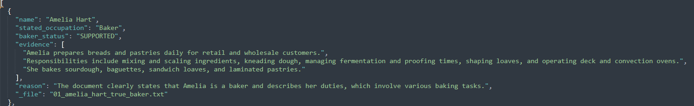

# Agentic Role Check Demo

A lightweight demonstration of **controlled AI execution** using the OpenAI API.

This project evaluates flat `.txt` files representing individual profiles.  
Each file may contain:

- A stated occupation
- A job description
- Supporting (or conflicting) responsibilities

The agent must determine — based only on the document text — whether the person is truly a **BAKER**.

Importantly, some files include a **false or misleading self-described label** (e.g., someone claims “baker” but performs no baking duties).

This ensures the system is **not performing a simple keyword search**.  
Instead, the model must:

- Analyze responsibilities
- Compare claims against duties
- Detect contradictions
- Provide verbatim evidence
- Return structured JSON under a strict schema

The real objective is demonstrating a reproducible, auditable agent loop:

------------------------------------------------------------------------

## 📘 Table of Contents

- [Project Structure](#project-structure)
- [Installation](#installation)
- [Setting Up OpenAI API Access](#setting-up-openai-api-access)
  - [Create an OpenAI Account](#create-an-openai-account)
  - [Add Billing](#add-billing)
  - [Generate an API Key](#generate-an-api-key)
- [Environment Setup](#environment-setup)
- [Agentic API Design Philosophy](#agentic-api-design-philosophy)
- [Biggest Issue with AI + API Calling](#biggest-issue-with-ai--api-calling)
- [Token Planning Guide](#token-planning-guide)
- [Engineering Takeaway](#engineering-takeaway)
- [Running the Demo](#running-the-demo)
- [Why This Matters](#why-this-matters)

------------------------------------------------------------------------

## 📁 Project Structure

Place your files in the following layout:

    people_demo/
      sample_people/
        01_amelia_hart_true_baker.txt
        02_marcus_lee_false_baker_label.txt
        03_priya_nair_data_analyst.txt
        04_jose_alvarez_chef_trap_overlap.txt
        05_sarah_kim_flight_attendant.txt
      run_role_check.py
      .env

------------------------------------------------------------------------

## ⚙️ Installation

Install required dependencies:

    pip install openai python-dotenv

------------------------------------------------------------------------

## 🔑 Setting Up OpenAI API Access

To run this project, you need an OpenAI API key.

### 1️⃣ Create an OpenAI Account

1.  Go to https://platform.openai.com\
2.  Sign up or log in.\
3.  Verify your email if prompted.

------------------------------------------------------------------------

### 2️⃣ Add Billing (Buy Tokens)

The OpenAI API is usage-based (pay per token).

1.  Navigate to **Billing** in the dashboard.\
2.  Add a payment method (credit/debit card).\
3.  Optionally set a monthly spending limit for safety.

For small demos like this, usage typically costs only a few cents.

------------------------------------------------------------------------

### 3️⃣ Generate an API Key

1.  Go to **API Keys** in the dashboard.\
2.  Click **Create new secret key**.\
3.  Copy the key immediately (you won't be able to see it again).

It will look like:

    sk-xxxxxxxxxxxxxxxxxxxxxxxx

------------------------------------------------------------------------

## 🔐 Environment Setup

Create a `.env` file in the root directory:

    OPENAI_API_KEY=your_key_here
    OPENAI_MODEL=gpt-4o-mini

Using `python-dotenv` keeps credentials out of source control and makes
the demo clean and portable.

⚠️ Security Note: This repository does not include a .env file.
API keys are sensitive credentials and must never be committed to source control.
Create your own .env locally and ensure it is listed in .gitignore.

------------------------------------------------------------------------

## 🧠 Agentic API Design Philosophy

This demo uses structured, agent-style prompting:

-   Each file is evaluated independently
-   Prompts are minimal and role-focused
-   Output is structured JSON
-   No long context windows
-   No stuffing multiple documents into a single call

This avoids a major hidden failure mode of large language models.

------------------------------------------------------------------------

# 🚨 Biggest Issue with AI + API Calling

## Cognitive Drift + Hallucination

Once you stuff a large amount of text into the context window, model
performance often degrades instead of improving.

This is counterintuitive.

Engineers frequently assume:

> "More context = more accuracy."

In practice:

-   Attention becomes diluted
-   Signal-to-noise ratio drops
-   Subtle contradictions get ignored
-   The model begins inferring beyond the provided evidence

Large prompts increase:

-   Hallucination risk
-   Instruction drift
-   Cost
-   Latency

This demo intentionally keeps calls small and controlled.

------------------------------------------------------------------------

## 📏 Token Planning Guide

For engineering estimation:

**1,000 words ≈ 1,300--1,500 tokens**\
**Tokens ≈ words × 1.3**

### Easy Mental Conversions

  Tokens    Approx Words
  --------- --------------
  1,000     \~750
  5,000     \~3,800
  10,000    \~7,500
  100,000   \~75,000

------------------------------------------------------------------------

## 🏗 Engineering Takeaway

For agentic document parsing systems:

-   Keep prompts small
-   Chunk larger documents
-   Use retrieval (RAG) when needed
-   Keep API calls under \~10--20k tokens
-   Never assume bigger context equals better reasoning

Well-designed small calls often outperform massive context dumps.

------------------------------------------------------------------------

## ▶️ Running the Demo

Once your `.env` is configured and dependencies are installed:

    python run_role_check.py

The script will:

-   Iterate over the `sample_people` folder
-   Evaluate each profile
-   Output structured results (e.g., JSON)

  ### 📄 Example JSON Output

Below is a sample structured output generated by the agent:

The agent extracts structured fields including:

- `name`
- `stated_occupation`
- `baker_status`
- `evidence` (direct text excerpts from the source file)
- `reason` (concise model justification)
- `_file` (source filename reference)

This demonstrates how the loop produces deterministic, structured outputs from unstructured text inputs.

------------------------------------------------------------------------

## 🎯 Why This Matters

This project demonstrates:

-   Controlled AI execution
-   Deterministic evaluation pipelines
-   Structured output enforcement
-   Practical token budgeting
-   Real-world API design discipline

AI systems should be architected --- not prompted casually.

---

## ⚖️ Disclaimer

This repository was created for educational and demonstration purposes only.

Created by **M. Joseph Tomlinson IV**  
Contact: mjtiv@udel.edu  

Feel free to use, modify, adapt, and build upon this project as you see fit.

